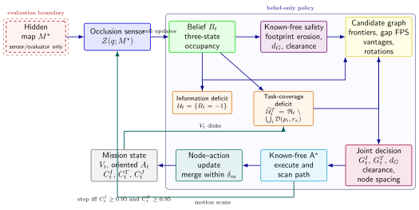

# SSTG-Explorer 论文架构：11 页扩展主稿、RA-L 压缩与 T-RO 路线

本文档给出可直接据此写稿的科学叙事、章节结构、架构图、图表计划和投稿门槛。正式英文稿位于同级 `../SSTGExplorerPaper/root.tex`。

## 1. 论文定位

建议标题：

> **SSTG-Explorer: Joint Sensor and Topological Coverage for Task-Effective Robot Exploration**

一句话问题：

> 当 8–16 m 的长量程 sensor 已把 occupancy map 看全，机器人如何仍只依靠在线 belief，建立由 2 m 任务半径约束的安全、稀疏、非冗余观测拓扑？

高层应用价值不是“能画完整网页”，而是：地图构建只回答“哪里可通行”；巡检、语义理解、重定位和后续交互还需要机器人在适当工作距离留下可再次使用的观测站。Sensor completeness 与 task-effective observation completeness 的失配，是本文要提出并系统验证的新问题。

## 2. 科学贡献

建议只写三条：

1. **Dual-coverage formulation.** 区分遮挡约束的信息覆盖 \(C^I\) 和固定半径的拓扑观测覆盖 \(C^T\)，在严格 truth–belief information boundary 下要求二者同时达标。
2. **Belief-only online gap closure.** 从当前已知安全自由空间构造拓扑缺口，统一 multi-frontier、gap FPS、topological vantages 和 directional actions，以信息增益、边际拓扑增益、测地路程、净空和节点间距选择目标；空间节点与同点多朝向动作显式分离。
3. **Controlled three-case evidence.** 用全知 disk、旧 sensor-only 和新 joint 三种 case 证明 construct mismatch，并在 810-run joint 矩阵中检验 coverage、success、安全、节点/动作规模和空间冗余；明确报告路程与 RRT sparsity 的代价。

不要把 trace、截图、视频、网页或“有 810 runs”写成科研创新点。它们属于 reproducibility evidence。

## 3. 系统架构图

论文主架构图：

可编辑 TikZ 源：[sstg_joint_architecture.tex](figures/sstg_joint_architecture.tex)，投稿矢量版：[sstg_joint_architecture.pdf](figures/sstg_joint_architecture.pdf)。

图必须表达：

- 红色 evaluation boundary 内的 hidden \(M^\star\) 只通过 occlusion sensor 更新 belief；
- belief 同时产生 unknown-space deficit 与 known-free task-coverage deficit；
- candidate graph、joint utility 和 A* 全部 belief-only；
- motion scans 闭环更新；
- \(V_t\) spatial nodes 与 \(A_t\) oriented actions 分开；
- 终止条件是 \(C^I,C^T\ge0.95\)，不是其中任意一个。

## 4. 当前 11 页扩展主稿结构

当前 `root.pdf` 是 11 页、双栏、US Letter 的扩展工作稿，不再按 8 页 RA-L 上限删减主要结果。它的目标是先完整展示问题、方法、810-run 全矩阵、三协议、统计推断、五算法各 6 阶段过程、SSTG 候选生命周期和消融，再根据最终 venue 派生压缩稿或继续补证据。

### Abstract（≤200 words，约 0.25 页）

六句结构：

1. 应用挑战：long-range map completeness 掩盖 short-range observation gaps；
2. 问题定义：joint sensor + topology coverage；
3. 方法：belief-only gap closure 与 node/action separation；
4. 设计：9 scenes × 6 sensors × 5 methods × 3 seeds；
5. 核心结果：旧 SSTG 98.38% sensor / 33.02% topology；joint 99.99% / 96.14%、100% success、冗余相对所有基线显著降低；
6. 诚实 trade-off：比 RRT 多 0.94 nodes、长 6.36 m；静态 2-D 限制。

### I. Introduction（约 1 页）

- 段 1：真实任务需要 observation scaffold，不只是 occupancy；
- 段 2：8–16 m sensor 与 2 m task radius 失配；
- 段 3：未知障碍、安全、稀疏、冗余和朝向的耦合挑战；
- 段 4：SSTG 直觉与贡献；
- 一句 scope：当前不评价 semantic recognition。

### II. Related Work（约 0.75 页）

按问题组织：

1. Frontier / NBV / informative exploration；
2. known-workspace coverage / inspection viewpoint planning；
3. graph and learning-based exploration；
4. semantic/topological and task-aware exploration。

每段末尾写“仍缺什么”，不要堆算法名单。VISTA/SCOUT 用来说明 task/semantic completeness 的趋势，不冒充已实现基线。

### III. Problem Formulation（约 1 页）

必须定义：

- hidden truth \(M^\star\)、belief \(B_t\)、first-obstacle observation；
- \(C^I,C^T,C^J\) 与双阈值；
- action \(a_k=(p_k,\theta_k)\) 和 node merge \(\delta_m\)；
- 多目标结果：coverage/success、distance、nodes/actions、clearance、redundancy；
- 三种 evidence case 不混检。

### IV. Method（约 2 页）

建议四小节：

A. Known-free footprint reachability

B. Multi-source online candidate graph

C. Dual gains and safe utility

D. Execution, node–action update, and trace

主公式：safe set、FPS、belief gap、\(G^I/G^T\)、joint utility、node merge；一份精简 Algorithm 1。Trace 只用末段说明审计用途。

### V. Experiments（约 6 页，含两页过程图）

A. Protocol, information boundary, sensors, scenes, adapters, and statistics

B. Three coverage cases + combined 17-column table

C. Cluster-level effects and safety/redundancy Pareto

D. Five-policy matched decision evolution：5 methods × 6 aligned stages = 30 panels

E. Inside SSTG candidate lifecycle：首轮候选、frontier/vantage、map target、重复拒绝、post-sensor gap closure、joint termination

F. Full 270-cell sensor--scene atlas and 15-row hard-scene table

G. Post-sensor gap closure, ablation, audit, and reproducibility

主张顺序：先用真实三阶段图和三协议总表证明 construct mismatch；再给 54-cluster 推断；随后展示同场景逐步过程、所有 sensor--scene cells 和困难场景逐方法结果；最后报告开发阶段选择、消融负结果和审计。

### VI--VII. Discussion and Conclusion（约 1 页）

- 三协议回答不同问题；
- 95% threshold overshoot；
- 2 m disk 是 proximity proxy；
- SSTG 的 Pareto 优势和明确 travel 代价；
- static 2-D / perfect pose / ideal ray / adapters / 3 seeds；
- real robot 和 calibrated task-valid visibility 是下一证据门槛。

### References（约 1 页）

保留直接支撑问题、方法、基线和 task-aware positioning 的 25–30 篇。所有 benchmark 方法必须有原始参考文献。

## 5. Venue 路线

### 5.1 保持 11 页扩展工作稿

这是当前推荐的内部审稿版本：结果完整、图表自包含、无需读网页才能理解主要证据。11 页是当前完整展示所需的工作稿长度，不是 T-RO 的官方页数上限。

### 5.2 RA-L 压缩稿

IEEE RA-L 当前规则为 6 页正文含图表和参考文献，可付费增加 2 页，最大 8 页，见 [RA-L Information for Authors](https://www.ieee-ras.org/publications/ra-l/ra-l-information-for-authors/) 和 [FAQ](https://www.ieee-ras.org/publications/ra-l/faq/)。若确定投 RA-L，应从 11 页稿派生独立压缩版：30-panel 过程对照图、SSTG lifecycle 或完整 atlas 可移 multimedia/supplement，但三协议总表、cluster effect 和主要负结果不能删除。

### 5.3 T-RO / Transactions 扩展

T-RO 当前 regular paper 初稿最多 18 页、终稿最多 20 页，见 [T-RO Information for Authors](https://www.ieee-ras.org/publications/t-ro/t-ro-information-for-authors/)。现有 11 页稿只解决了“展示不足”，还没有自动达到 T-RO 的外部有效性门槛；建议新增：

- 多个真实建筑/公开 occupancy datasets，明确 external holdout；
- 真实机器人 LiDAR/depth camera，标定位姿、碰撞/estop、时间、yaw、任务覆盖；
- sensor noise、pose uncertainty、dynamic obstacle robustness；
- \(r_v\in\{1,2,3\}\) m 或 task-valid visibility sensitivity；
- semantic/inspection downstream：识别率、view diversity 或重定位成功率；
- joint utility 和 gap generator 的严格消融/复杂度/参数敏感性；
- 可能的多机器人或长期巡检扩展。

没有这些新增内容时，应把稿件称为完整的 simulation study，而不是仅凭页数宣称达到 T-RO 证据强度。

## 6. 主图表计划

| 编号 | 内容 | 科学问题 |
|---|---|---|
| Fig. 1 | 同一 dense 场景的 sensor-only 终止 / map-complete gap / joint-complete 三阶段 | 为什么 sensor 完成后还需探索？ |
| Fig. 2 | joint architecture | 方法如何在 belief-only 边界内闭环？ |
| Fig. 3 | 三协议 slopegraph + gap-closing cost bubble | construct mismatch 及其代价有多大？ |
| Fig. 4 | clearance–NN scatter，bubble=redundancy | 安全/稀疏/冗余 Pareto 如何？ |
| Fig. 5 | 五算法 × 三里程碑真实过程截图 | 各策略怎样从发现转入/未转入 gap closure？ |
| Fig. 6 | 5 methods × 6 sensors × 9 scenes 的 270-cell atlas | 宏平均隐藏了哪些 sensor--scene failure？ |
| Table I | 三协议 × 全方法 × coverage/travel/nodes/success/quality 总表 | 全部工作量和结果如何统一比较？ |
| Table II | 七个 outcome 的 cluster effect + Holm p | 哪些差异稳健？ |
| Table III | 三个困难场景 × 五方法的 15 行表 | dense/rooms/warehouse 的具体代价是什么？ |
| Table IV | joint hard-scene 单因素消融 | 模块行为和负结果是什么？ |

图表全部由 `SSTGExplorerPaper/figures/generate_paper_figures.py` 从冻结结果自动生成；不手工抄数。

## 7. 论文主张边界

### 可写

- Sensor coverage 与 fixed-radius topology coverage 是不同 construct；
- SSTG 在 162 joint runs 中 100% 完成；
- SSTG relative redundancy 对四个 baselines 均显著更低；
- 节点/动作少于 ANS、Frontier、NBV；净空高于 ANS、Frontier；
- multiple_rooms、dense_obstacles、warehouse 全六 sensors 均成功；
- 结果是 reliability/nonredundancy/safety 与 travel 的 Pareto trade-off。

### 不可写

- 所有指标 SOTA、shortest、universally safest；
- terminal coverage 高一点就是更好（阈值 overshoot）；
- 2 m disk 证明 semantic/inspection accuracy；
- 仿真证明部署安全；
- adapted ANS/RRT 是原完整系统；
- webpage/trace/video 是科研创新。

## 8. 审稿门槛

投稿前逐项通过：

- [x] 摘要 ≤200 words，所有数字来自 `joint_benchmark_selected/20260719_223630`；
- [x] title/abstract/contributions 中无 trace/web novelty；
- [x] 公式与 `UnknownExplorerConfig`、utility 实现一致；
- [x] nodes/actions 在全文和图表中不再混用；
- [x] 810-run audit `passed=true`；
- [x] selected SSTG 162/162 与 frozen baseline 20/20 reproducibility exact match；
- [x] cluster CIs、Wilcoxon、Holm、effect size 一致；
- [x] 11/11 fallacy scan 完成；
- [x] 失败 run 和不利 travel 结果保留；
- [x] 扩展稿 PDF 11 页 letter、字体嵌入、无 undefined refs/citations/overfull；若投 RA-L，另建 ≤8 页压缩稿；
- [ ] real-robot TODO 在投稿前完成，或明确选择 simulation-only 风险；
- [ ] 永久匿名代码/data URL、LICENSE、funding/COI/CRediT 填完；
- [x] Round-2 reviewer report 无 P0/critical issue，并完成 Stage 4.5 风格引用/数据/图表完整性复核。

## 9. 多媒体

RA-L/T-RO 多媒体是单个不超过 50 MB 的 zip，并含 ASCII `ReadMe.txt` 与 `Summary.txt`。建议从 270 个视频中剪一个 3–5 分钟合成 MP4：

- 360° dense：sensor saturation 后 gap closure；
- 120° multiple rooms：多朝向 action 与节点合并；
- 90° warehouse：困难长路径与 coverage；
- 一段 candidate pruning 和 belief/truth boundary 解释。

完整 270 视频和原始 CSV 放永久仓库，不直接塞入投稿 zip。
