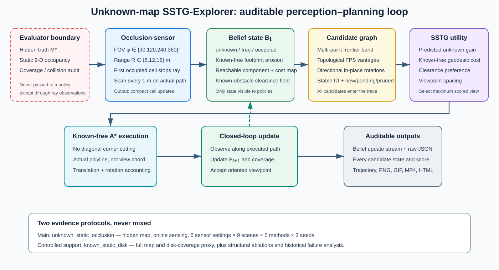
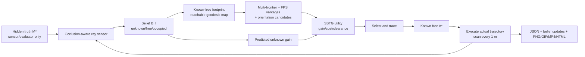
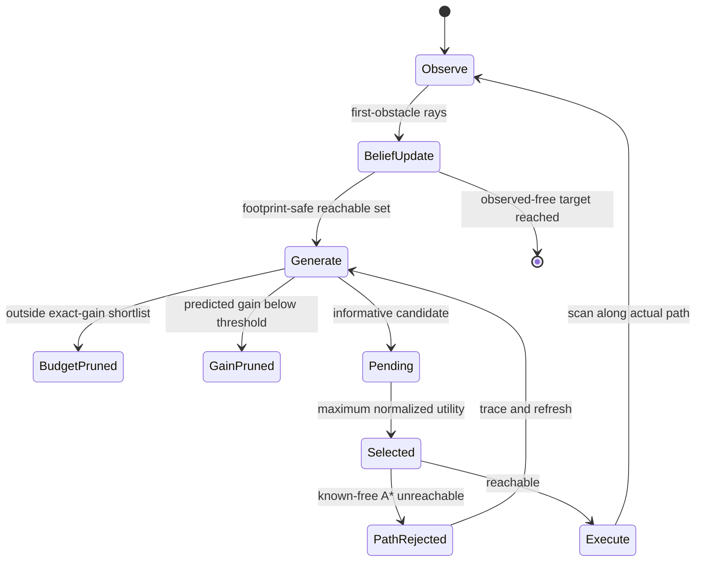

# SSTG-Explorer：IEEE Robotics and Automation Letters 文章架构

本文档按 IEEE RAL 的“短而完整”体裁设计。按 2026-07-19 核验的官方规则，正文、图、表和参考文献共 6 页，最多付费增加 2 页；不能用 appendix 或其他 supplementary material 超过 8 页。投稿前仍须核对 [RAL Information for Authors](https://www.ieee-ras.org/publications/ra-l/ra-l-information-for-authors/) 与 [RAL FAQ](https://www.ieee-ras.org/publications/ra-l/faq/)。

## 1. 论文定位

建议主标题：

> **SSTG-Explorer: Traceable Occlusion-Aware Viewpoint Exploration for Spatial-Semantic Topological Mapping**

主问题应改为：在静态二维占据栅格内容未知、位姿完美的条件下，机器人如何只依靠受 FOV、量程和墙体遮挡约束的在线观测，生成兼顾信息增益、可达性、障碍净空和空间离散性的有向语义观测节点。unknown_static_occlusion 是论文主协议；原 known_static_disk 保留为受控结构规划协议，用来隔离测地队列、recovery 和 clearance 等模块，不再冒充在线未知空间探索。

建议贡献：

1. 提出 belief-only、遮挡感知的 SSTG 闭环：多代表 frontier、确定性拓扑视点和有向旋转候选统一进入可追踪候选图。
2. 设计 FPS 空间离散候选与联合 predicted gain、known-free 测地代价、视点净空的可审计效用，并保证 cost-map reachability 与禁止斜穿墙角的 A* 一致。
3. 把候选生成、精确增益预算剪枝、选择、不可达、实际路径扫描和 belief cell update 全部保存，直接导出逐步图、轨迹、视频与网页。
4. 在 6 组 FOV/range、9 类环境、5 种在线方法和 3 seeds 上报告主结果，并用已知地图 270-run 主表与 315-run 消融提供互补的结构证据。

不要把“脚本完整”单独写成算法贡献，也不要写“全面优于所有方法”；主张必须与最终统计表一致。

## 2. 系统架构图

论文主图应使用 [unknown-map SSTG-Explorer architecture SVG](figures/sstg_explorer_unknown_architecture.svg)，它明确画出 evaluator-only truth 边界、在线 ray observation、belief-only policy、候选图、SSTG utility、known-free A*、闭环更新和可审计输出：

已知地图结构规划图 [known-map architecture SVG](figures/sstg_explorer_architecture.svg) 只用于补充材料或 known-protocol 小图，不宜再作为主 Fig. 2。

图中红色虚线 evaluator boundary 是审稿时最重要的信息隔离：policy 不读取 truth。候选 graph + normalized utility + footprint-safe geodesic execution 是方法主体；ray caster 和 A* 是可替换模块。

## 3. 单步决策状态机

论文中的 decision-trace 图应使用 `scripts/run_unknown_benchmark.py` 产生的真实逐步图：左侧只画 policy belief，右侧 truth 明确标注 evaluation-only；每个候选必须有 ID、kind、heading、gain、geodesic cost、clearance、spacing、priority 和状态，不能只画一个覆盖圆。

## 4. 六页主文布局

### I. Introduction（0.75 页）

- 第一段：语义拓扑图需要“在哪里观察”，而不只是“哪里尚未建图”。
- 第二段：frontier/NBV/CPP 的目标与视觉重叠、安全视点和可审计候选决策之间的缺口。
- 第三段：方法直觉与 Fig. 1。
- 末尾给出三至四条可验证贡献。

### II. Related Work（0.55 页）

按问题而非算法名字组织：coverage/frontier exploration、active perception/NBV、learning-based exploration、semantic/topological mapping。每段最后一句说明 SSTG-Explorer 的差别。基线出处见 `REFERENCES.bib` 和 `BENCHMARK_GUIDE.md`。

### III. Problem Formulation（0.55 页）

定义 hidden truth \(M^\star\)、三值 belief \(B_t\)、first-obstacle ray visibility、observed-free coverage、机器人 footprint 已知自由域、oriented viewpoint 和实际路径代价。用一个红框 invariant 明确：truth 只供 sensor/evaluator；policy 只能读 \(B_t\)。随后用两句话说明 known_static_disk 是受控辅助协议。

### IV. Method（1.70 页）

建议小节：

- A. Occlusion-aware belief update and footprint-safe reachability
- B. Multi-frontier and topological viewpoint graph
- C. Gain–geodesic–clearance utility and FPS spacing
- D. Traceable A* execution and online update

至少放 observation update、SSTG utility、redundancy 三个主公式和精简 Algorithm 1。圆盘覆盖、known-map recovery 和完整复杂度可压到辅助材料；完整 41 个公式在 `PAPER_WRITING_REFERENCE.md`。

### V. Experiments（1.45 页）

- Main unknown setup：9 环境、5 在线方法、3 seeds、360°/240°/120°/90° FOV 与 8/12/16 m range。
- Main results：observed-free coverage、实际路径、oriented nodes、成功率、runtime；按 sensor–environment cluster 做统计。
- Spatial quality：mean/median/min nearest-neighbor distance、<1 m 回访率、coverage/view、in-place rotations、视点/实际路径净空。
- Sensor sensitivity：固定 12 m 的 FOV 曲线与固定 360° 的 range 曲线。
- Controlled support：已知地图 270-run 主表与 315-run 结构消融；未知 hard-set 的 180-run single-centroid、unsafe-footprint、no-vantage、with-spacing 消融。
- Failure/trace：展示一次预算剪枝、一次 directional rotation、一次长程 topological vantage，以及仍然存在的 2-D/noise-free 局限。

### VI. Discussion and Conclusion（0.45 页）

讨论 2-D 静态/完美位姿/理想射线假设、ANS 和 RRT 的协议适配、无真实机器人/无动态障碍。已知地图 disk proxy 只作为受控证据。结论只复述正式 3-seed 数据支持的结果。

### References（约 0.5 页）

优先保留直接影响方法和 benchmark 的 18–25 篇文献。RAL 页数包含参考文献，避免无关综述堆积。

## 5. 图表计划

| 编号 | 内容 | 目的 |
|---|---|---|
| Fig. 1 | belief/truth、候选和实际轨迹的真实逐步图 | 一图定义任务并展示可追踪性 |
| Fig. 2 | unknown-map 闭环 SVG 架构图 | 解释信息边界、模块和闭环 |
| Fig. 3 | FOV/range sensitivity + coverage heatmap | 证明传感器结论不是单配置偶然 |
| Fig. 4 | clearance–NN spacing–coverage 气泡图 | 展示安全、离散性与覆盖权衡 |
| Table I | 5 方法、6 sensor configs 与公平协议 | 可复现性 |
| Table II | unknown 主结果 mean ± std/cluster CI | 核心证据 |
| Table III | known 结构消融 + unknown failure fixes | 证明模块必要性 |
| Table IV | NN、冗余率、coverage/view、rotation、净空 | 回答“视点是否离散且不重复” |

如果受 6 页限制，Table I 放入正文紧凑栏，完整逐环境表由代码仓库网页提供；不能把支持核心主张的结果只放网页。

## 6. 审稿前证据门槛

- 所有数字均能追溯到一个带 Git commit、命令、seed 和 checkpoint hash 的 `manifest.json`。
- unknown 主结果严格为 \(6\times9\times5\times3=810\) 条；known 结果单独为 270 条。
- 每个 unknown run 的 trace 可由 `observed_updates` 重放 belief，并包含所有生成候选的 ID、位置、朝向、gain、cost、clearance、spacing、priority 与状态。
- 显著性检验以 environment–seed 为实验单位，不把候选或节点伪装成独立样本。
- ANS 结果始终写作 “ANS-Global (adapted)”，并说明没有比较其 RGB mapper/local policy。
- unknown A* 只经过完整 footprint 已知 free 的栅格；dense、warehouse 和 narrow 不再因把偏好 margin 当硬机器人尺寸而人为断开。
- 消融必须重新运行，不能从不同代码 commit 的历史结果拼表。

## 7. RAL 多媒体交付

完整 benchmark 网页和原始数据放长期仓库；它们不能替代自包含论文。RAL 当前只允许单个不超过 50 MB 的 multimedia zip，多个片段要编辑成一个视频，并随包提供 ASCII `ReadMe.txt` 与 `Summary.txt`。正式包建议只放：90° dense/warehouse、360° multiple_rooms、一次候选剪枝/拓扑回访的合成 MP4，以及运行环境、播放器版本、联系人和仓库永久链接。不要把 270 个 run-0 视频直接塞进投稿附件。

## 8. 冻结证据对应主张

主表用 `outputs/unknown_benchmark_runs/20260719_141122/`：SSTG 为 98.38% coverage、15.73 m、4.57 views、3.69 m NN、26.5% redundancy、100% success。摘要可以写“相对 Frontier/NBV/RRT 显著更高 coverage，travel distance 无显著差异，同时使用更少且更离散的 oriented viewpoints”；不能写相对 ANS 显著，也不能写净空或路径全面最优。

模块证据用 `outputs/unknown_ablation_runs/20260719_141132/`：single-centroid 使 coverage 降 1.89 pp、success 降 8.3 pp；额外 spacing score 没有改善宏平均，因此 FPS-only 是最终方案。已知地图 270+315 runs 只用于证明 geodesic/recovery/clearance 的受控结构作用，不与 observed-free coverage 数字合并。
