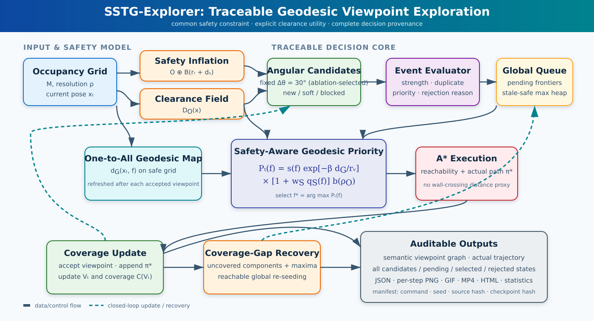
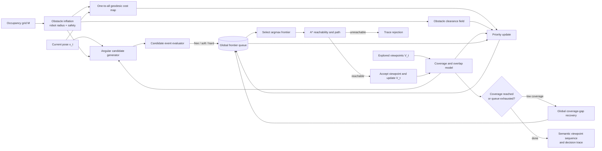
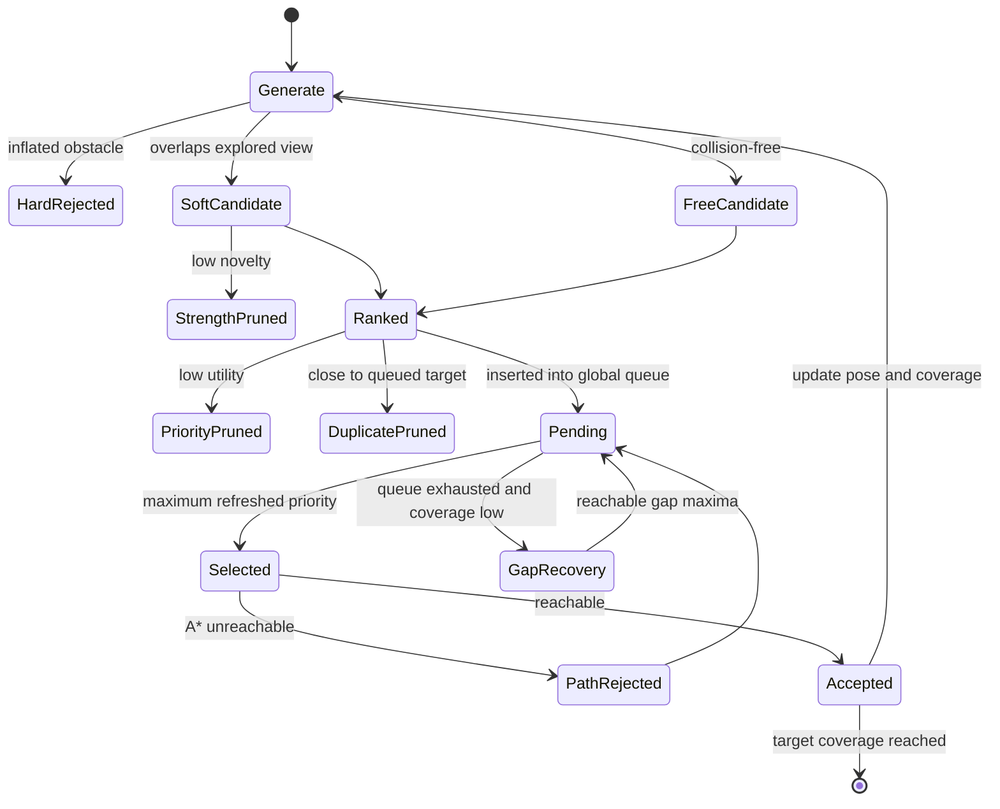

# SSTG-Explorer：IEEE Robotics and Automation Letters 文章架构

本文档按 IEEE RAL 的“短而完整”体裁设计。RAL 当前要求正文、图、表和参考文献共 6 页，最多付费增加 2 页；没有额外 appendix。投稿前仍须核对 [RAL Information for Authors](https://www.ieee-ras.org/publications/ra-l/ra-l-information-for-authors/) 与 [RAL FAQ](https://www.ieee-ras.org/publications/ra-l/faq/)。

## 1. 论文定位

建议标题：

> **SSTG-Explorer: Traceable Geodesic Viewpoint Exploration for Spatial-Semantic Topological Graph Construction**

核心问题不是一般意义的未知空间 SLAM，而是：给定二维占据栅格与机器人/传感器约束，生成同时满足覆盖、可达、安全间距和视觉重叠需求的观测节点序列。论文必须明确这一输入协议，避免与 RGB-only embodied exploration 混淆。

建议贡献：

1. 提出可追踪的全局候选队列，每个角向观测候选均保留生成、碰撞、剪枝、优先级更新和选择结果。
2. 用障碍感知测地代价替代跨墙欧氏距离，并通过覆盖缺口恢复解决局部队列耗尽问题。
3. 提供逐决策 trace、完整候选状态、路径、原始数据、视频和网页，实现可审计的探索 benchmark。
4. 在九类占据栅格环境中与 Uniform、RRT、Frontier、NBV 和公开权重的 ANS-Global 适配基线比较，并报告失败模式与协议差异。

不要把“脚本完整”单独写成算法贡献，也不要写“全面优于所有方法”；主张必须与最终统计表一致。

## 2. 系统架构图

可直接用于论文排版的矢量图见 [SSTG-Explorer architecture SVG](figures/sstg_explorer_architecture.svg)。下方 Mermaid 保留为可编辑源式描述：

图中“global queue + geodesic refresh + gap recovery”是方法主体；A*、占据栅格和距离变换是可替换基础模块。

## 3. 单步决策状态机

论文 Fig. 2 应使用 `scripts/run_benchmark.py` 产生的真实逐步图，而不是重新手画一个与代码不一致的例子。

## 4. 六页主文布局

### I. Introduction（0.75 页）

- 第一段：语义拓扑图需要“在哪里观察”，而不只是“哪里尚未建图”。
- 第二段：frontier/NBV/CPP 的目标与视觉重叠、安全视点和可审计候选决策之间的缺口。
- 第三段：方法直觉与 Fig. 1。
- 末尾给出三至四条可验证贡献。

### II. Related Work（0.55 页）

按问题而非算法名字组织：coverage/frontier exploration、active perception/NBV、learning-based exploration、semantic/topological mapping。每段最后一句说明 SSTG-Explorer 的差别。基线出处见 `REFERENCES.bib` 和 `BENCHMARK_GUIDE.md`。

### III. Problem Formulation（0.55 页）

定义占据空间、安全自由空间、视野覆盖、观测点序列、路径代价和多目标优化。必须说明仿真使用已知静态栅格，学习基线是 global-policy adapter，而不是完整 RGB ANS。

### IV. Method（1.65 页）

建议小节：

- A. Safety-aware angular candidates
- B. Traceable global frontier queue
- C. Geodesic priority and A* execution
- D. Coverage-gap recovery and termination

至少包含 Algorithm 1 和优先级主公式。完整公式草案在 `PAPER_WRITING_REFERENCE.md`。

### V. Experiments（1.55 页）

- Setup：9 环境、6 方法、5 seeds、共同机器人/视野参数、CPU/GPU和软件版本。
- Main results：coverage、distance、nodes、success rate、runtime。
- Spatial quality：视点/实际路径的障碍净空、边界净空、安全比例、nearest-neighbor spacing、dispersion。
- Ablation：Euclidean vs geodesic；without recovery；without clearance utility；localized stale priority；fixed 30° vs adaptive 15° sampling。
- Failure/trace：至少展示一次被障碍拒绝、一次全局恢复和一个仍有局限的例子。

### VI. Discussion and Conclusion（0.45 页）

讨论已知地图假设、圆形视野近似、2D 仿真、ANS 适配协议和真实机器人缺失。结论只复述数据支持的结果。

### References（约 0.5 页）

优先保留直接影响方法和 benchmark 的 18–25 篇文献。RAL 页数包含参考文献，避免无关综述堆积。

## 5. 图表计划

| 编号 | 内容 | 目的 |
|---|---|---|
| Fig. 1 | 任务定义与语义视点图 | 区分 mapping frontier 与 semantic viewpoint |
| Fig. 2 | 上述方法架构图 | 解释模块和闭环 |
| Fig. 3 | 一帧完整 decision trace | 展示候选、拒绝、pending、selected、A* |
| Fig. 4 | 9 环境 coverage heatmap | 主结果 |
| Fig. 5 | coverage–distance Pareto 图 | 展示多目标权衡 |
| Table I | 参数、环境和公平协议 | 可复现性 |
| Table II | 6 方法主结果 mean ± std/CI | 核心证据 |
| Table III | 6 项模块消融 | 证明各模块必要性与代价 |
| Table IV | 视点/路径安全性与边界净空 | 证明安全收益不是只由覆盖率代理 |

如果受 6 页限制，Table I 放入正文紧凑栏，完整逐环境表由代码仓库网页提供；不能把支持核心主张的结果只放网页。

## 6. 审稿前证据门槛

- 所有数字均能追溯到一个带 Git commit、命令、seed 和 checkpoint hash 的 `manifest.json`。
- 主结果记录数严格等于 `methods × environments × seeds`。
- 每个 SSTG run 的 trace 包含所有生成候选及状态，不只包含最终节点。
- 显著性检验以 environment–seed 为实验单位，不把候选或节点伪装成独立样本。
- ANS 结果始终写作 “ANS-Global (adapted)”，并说明没有比较其 RGB mapper/local policy。
- dense_obstacles 的起点在机器人膨胀后仍可行；narrow_passages 在相同膨胀模型下连通。
- 消融必须重新运行，不能从不同代码 commit 的历史结果拼表。
